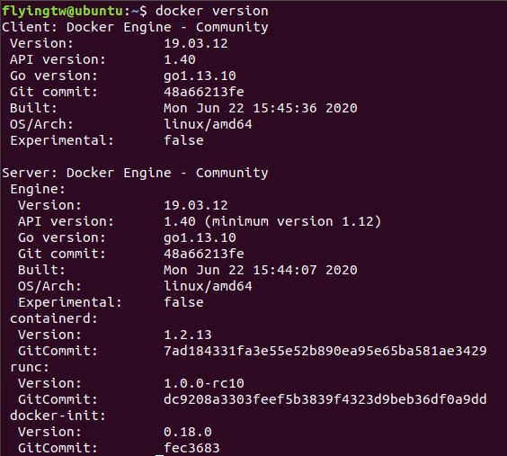
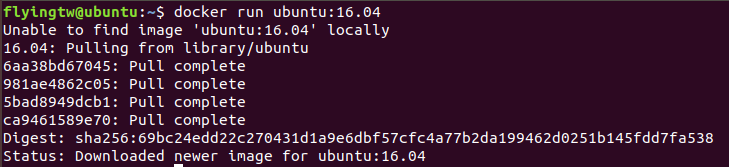

# Docker 실습 01

 가상머신 OS(Ubuntu) 위에 Docker 를 설치하여 실습하고자 한다. 

윈도우의 WSL2 를 사용하면 성능이 조금 더 향상되고 가상 머신의 무분별한 자원 낭비를 줄일 순 있지만 경로 설정 문제($HOME등), SSH 문제(재부팅마다 IP가 바뀌어 별도의 스크립트를 작성하여 포워딩)가 있다고 하여 VMware 를 사용한다.


**환경**

`가상 머신 : VMware`

`OS : Ubuntu 18.04.3`

`core : 2`

`memory : 2GB`

------

#### Docker 설치하기

```shell
curl -fsSL https://get.docker.com/ | sudo sh
```

간단하게 docker.com 홈페이지에서 도커를 설치하는 명령어이다. 자동 설치 스크립트를 사용하는것이 가장 쉬운 방법이다.


##### sudo 권한 부여

```shell
sudo usermod -aG docker $USER #현재 접속중인 사용자에게 권한주기
sudo usermod -aG docker [사용자] #사용자에게 권한 주기
```

 기본적으로 docker 는 root 권한이 필요하다. root 가 아닌 사용자에게 sudo 권한을 부여한다.


##### 설치 확인

```shell
docker version
```

 Docker 버전을 확인한다. 



위와 같이 클라이언트와 서버로 버전정보가 나뉘어서 출력된다. 도커는 하나의 실행파일이지만 각각 클라이언트와 서버 역할을 할 수 있다. 즉, 도커 커맨드를 입력하면 도커 클라이언트가 도커 서버로 명령을 전송하고 결과를 받아 터미널에 출력해 준다.

> docker run -> docker daemon(도커 서버) -> 결과 출력


#### 컨테이너 실행

```shell
docker run [OPTIONS] IMAGE[:TAG|@DIGEST] [COMMAND] [ARG...]
```

 도커를 실행하는 명령어는 기본적으로 **run** 이다. 그 이후에 여러가지 옵션을 주거나 도커 이미지를 활용할 수 있다. 


> docker option

| 옵션  | 설명                                                   |
| :---- | :----------------------------------------------------- |
| -d    | detached mode 흔히 말하는 백그라운드 모드              |
| -p    | 호스트와 컨테이너의 포트를 연결 (포워딩)               |
| -v    | 호스트와 컨테이너의 디렉토리를 연결 (마운트)           |
| -e    | 컨테이너 내에서 사용할 환경변수 설정                   |
| –name | 컨테이너 이름 설정                                     |
| –rm   | 프로세스 종료시 컨테이너 자동 제거                     |
| -it   | -i와 -t를 동시에 사용한 것으로 터미널 입력을 위한 옵션 |
| –link | 컨테이너 연결 [컨테이너명:별칭]                        |


##### ubuntu 16.04  컨테이너

```shell
docker run ubuntu:16.04
```



 ubuntu 16.04 버전의 컨테이너를 생성하였다. run 하였을때 해당 이미지가 저장되어있는지 확인 한 후 없다면 다운로드(pull) 을 한 후 컨테이너를 생성(create)하고 시작(start) 한다. 컨테이너는 실행된 후 별도의 명령어가 있지 않았기 때문에 생성 되자마자 종료된다. 컨테이너는 **프로세스**이기 때문에 실행중인 프로세스가 없다면 컨테이너는 자동적으로 종료된다.

> exit : bash 쉘을 종료하면 컨테이너도 같이 종료된다.


##### redis 컨테이너

 redis는 메모리 기반의 다양한 기능을 가진 storage 이다. 6379 포트로 통신하며 telnet 명령어로 테스트 할 수 있다. 

```shell
docker run -d -p 1234:6379 redis
```

>   -d : detached mode(백그라운드 모드)
>
>   -p : 컨테이너의 포트를 호스트의 포트로 연결


 -d 옵션을 주게되면 실행후 컨테이너의 ID 를 보여주고 쉘로 돌아온다.(백그라운드에서 컨테이너는 실행되고 있는 상태) 컨테이너의 ID를 이용하여 컨테이너를 제어할 수 있다. 


 -p 옵션을 이용하여 호스트의 1234 포트를 컨테이너의 6379(redis) 포트와 연결하였고 localhost의 1234 포트로 접속하면 redis 를 사용 할 수 있다.


(여기부터 시작)

##### MySQL 5.7 컨테이너

 RDB중 유명한 MySQL 서버 컨테이너이다.

```shell
docker run -d -p 
```

>   -d : detached mode(백그라운드 모드)
>
>   -p : 컨테이너의 포트를 호스트의 포트로 연결


 -d 옵션을 주게되면 실행후 컨테이너의 ID 를 보여주고 쉘로 돌아온다.(백그라운드에서 컨테이너는 실행되고 있는 상태) 컨테이너의 ID를 이용하여 컨테이너를 제어할 수 있다. 


 -p 옵션을 이용하여 호스트의 1234 포트를 컨테이너의 6379(redis) 포트와 연결하였고 localhost의 1234 포트로 접속하면 redis 를 사용 할 수 있다.

